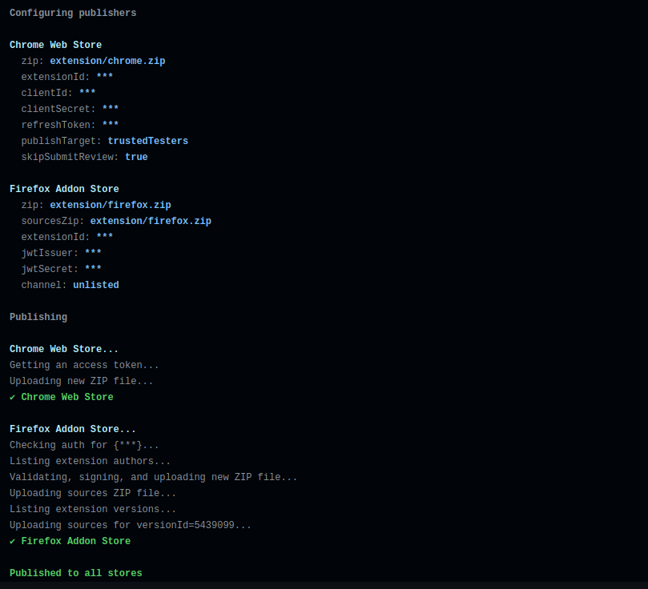

<h1 align="center">Publish Browser Extension</h1>
<p align="center">Publish an extension to all the extension stores in a single command!</p>



#### Features

- [x] Publish to the **Chrome Web Store**
- [x] Publish to the **Firefox Addon Store**
- [x] **Upload sources** to the Firefox Addon Store

###### Install

```bash
npm i -D publish-browser-extension
```

###### CLI Usage

```bash
publish-extension \
    --dry-run \
    --chrome-zip "dist/chrome.zip" \
    --chrome-extension-id "<cws-extension-id>" \
    --chrome-client-id "<gcp-client-id>" \
    --chrome-client-secret "<gcp-client-secret>" \
    --chrome-refresh-token "<gcp-refresh-token>" \
    --chrome-publish-target "<default|trustedTesters>" \
    --firefox-zip "dist/firefox.zip" \
    --firefox-sources-zip "dist/sources.zip" \
    --firefox-extension-id "<addons-extension-id>" \
    --firefox-jwt-issuer "<addons-jwt-issuer>" \
    --firefox-jwt-secret "<addons-jwt-secret>" \
    --firefox-channel "<listed|unlisted>"
```

> See `publish-extension --help` for details on generating and retrieving each of these values

###### JS Usage

<!-- prettier-ignore -->
```js
import { publishExtension } from 'publish-browser-extension';

publishExtension({
  dryRun: true,
  chrome: {
    zip: 'dist/chrome.zip',
    extensionId: '<cws-extension-id>',
    clientId: '<gcp-client-id>',
    clientSecret: '<gcp-client-secret>',
    refreshToken: '<gcp-refresh-token>',
    publishTarget: '<default|trustedTesters>',
  },
  firefox: {
    zip: 'dist/firefox.zip',
    sourcesZip: 'dist/sources.zip',
    extensionId: '<addons-extension-id>',
    jwtIssuer: '<addons-jwt-issuer>',
    jwtSecret: '<addons-jwt-secret>',
    channel: '<listed|unlisted>',
  },
})
  .then(results => console.log(results))
  .catch(err => console.error(err));
```

## Documentation

For docs, run `publish-extension --help`. It includes everything you'll need: examples, flags, environment variables, steps to retrieve secrets, etc.

## Contributing

<a href="https://github.com/aklinker1/publish-browser-extension/graphs/contributors">
  
</a>

### Setup

1. Install [node](https://nodejs.org)
2. Install [`pnpm`](https://pnpm.io/)
   ```bash
   npm i -g pnpm
   ```
3. Install dependencies
   ```bash
   pnpm i
   ```
4. Copy `.env.template` &rarr; `.env` and fill it out
   ```bash
   cp .env.template .env
   ```

### Scripts

Checkout the scripts in the `package.json`, they're all self-explanatory, but here are some examples:

```bash
pnpm format  # Run prettier to format source code
pnpm test    # Run unit tests
```

### Manual Testing

The `dev` scripts are going to be the main way of manually testing the tool. You can create test extensions on the stores and use the `dev` to publish to them.

Before you create the extension listings, run `pnpm gulp buildExtension` to build a simple test extension, `extension/chrome.zip`, `extension/firefox.zip`, and `extension/sources.zip`. Use those ZIP files for the initial upload.

Make sure you don't publish this test extension publicly by updating the `.env` file used for development.

```env
CHROME_SKIP_SUBMIT_REVIEW=true
CHROME_PUBLISH_TARGET=trustedTesters
FIREFOX_CHANNEL=unlisted
```

Then you can run the `dev` scripts to manually test out changes:

```bash
# Chrome
pnpm dev:chrome

# Firefox
pnpm dev:firefox

# Chrome and Firefox
pnpm dev:all
```
